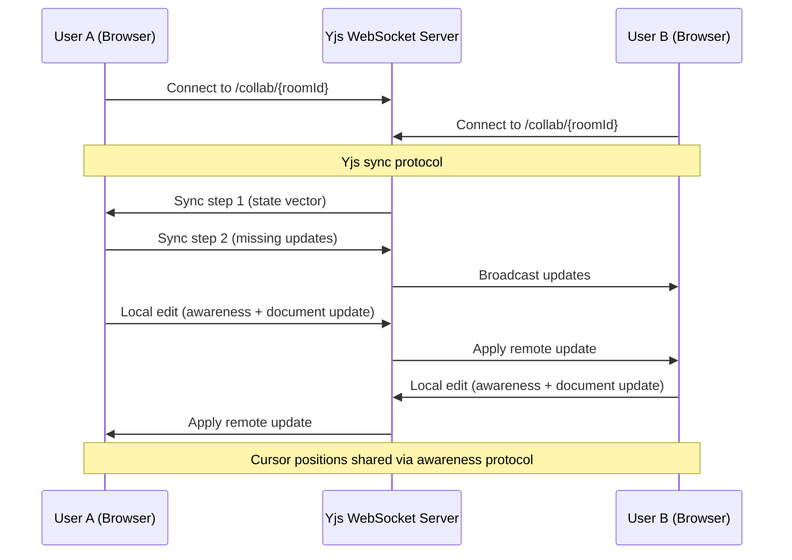
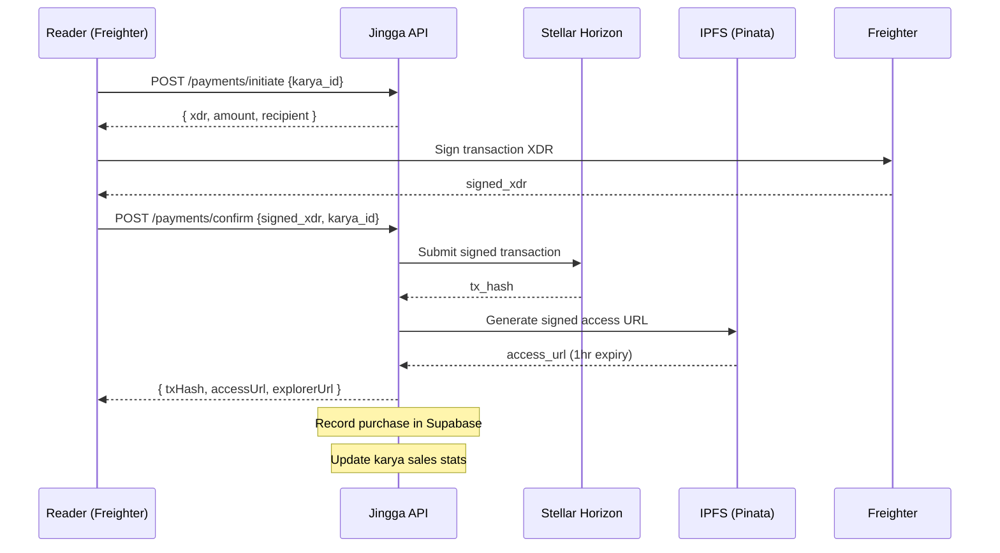
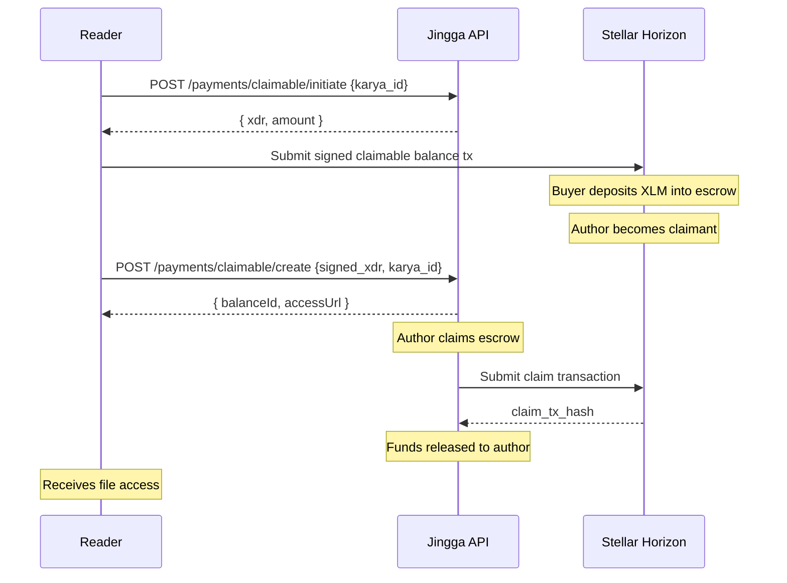

# Jingga

> Publication and royalty platform for independent writers, researchers, and creators across Southeast Asia. Built on Stellar: instant payments, transparent royalties, no middlemen.


## Table of Contents

- [Overview](#overview)
- [Architecture](#architecture)
- [Features](#features)
- [Smart Contracts](#smart-contracts)
- [Tech Stack](#tech-stack)
- [Getting Started](#getting-started)
- [Project Structure](#project-structure)
- [API Endpoints](#api-endpoints)
- [Stellar Integration](#stellar-integration)
- [Testing](#testing)
- [Deployment](#deployment)
- [Contributing](#contributing)
- [License](#license)

## Overview

Jingga is a Web3 publication platform that connects writers and readers directly on the Stellar blockchain. Writers publish their work as on-chain assets, set their own prices, and receive payments instantly, with zero platform fees. Smart contracts handle royalty splits for collaborators, and Stellar's built-in escrow (Claimable Balance) enables trustless transactions.

### Why Jingga?

- **Zero platform fees**: 100% of revenue goes to creators
- **Instant settlement**: payments arrive in seconds via Stellar network
- **Proof of ownership**: each work is minted as a unique Stellar asset
- **Automatic royalties**: Soroban smart contracts split revenue among collaborators
- **Cross-currency payments**: Stellar DEX enables payments in USDC, XLM, and more
- **Decentralized storage**: content is pinned to IPFS via Pinata

## Architecture

```
┌─────────────────────────────────────────────────────────────────┐
│                        Frontend (Next.js)                        │
│  ┌──────────┐ ┌──────────┐ ┌──────────┐ ┌───────────────────┐  │
│  │ Landing  │ │Marketplce│ │ Dashboard│ │    Rich Editor    │  │
│  │  Page    │ │  Browse  │ │  Stats   │ │ (TipTap + Yjs)   │  │
│  └──────────┘ └──────────┘ └──────────┘ └───────────────────┘  │
│                        ┌──────────────┐                         │
│                        │  Auth (JWT)  │                         │
│                        │   Freighter  │                         │
│                        └──────────────┘                         │
└────────────────────────────┬────────────────────────────────────┘
                             │ HTTP / WebSocket
                             ▼
┌─────────────────────────────────────────────────────────────────┐
│                      Backend (Express + tsx)                     │
│  ┌──────────┐ ┌──────────┐ ┌──────────┐ ┌───────────────────┐  │
│  │  Auth    │ │  Karya   │ │ Payments │ │   Collaboration   │  │
│  │ Routes   │ │  Routes  │ │  Routes  │ │  (Yjs WebSocket)  │  │
│  └──────────┘ └──────────┘ └──────────┘ └───────────────────┘  │
│  ┌──────────┐ ┌──────────┐ ┌──────────────────────────────┐    │
│  │ Stellar  │ │  IPFS    │ │       Soroban Contracts      │    │
│  │ Service  │ │ Service  │ │ (Royalty Split / License)    │    │
│  └──────────┘ └──────────┘ └──────────────────────────────┘    │
└───────────────┬──────────────────────────────────┬──────────────┘
                │                                  │
                ▼                                  ▼
┌──────────────────────┐            ┌──────────────────────────┐
│   Supabase (Postgres)│            │   Stellar Network        │
│  ┌────────────────┐  │            │  ┌────────────────────┐  │
│  │ users          │  │            │  │ Horizon (testnet)  │  │
│  │ karya          │  │            │  │ + Friendbot        │  │
│  │ transactions   │  │            │  └────────────────────┘  │
│  │ claimable_bal..│  │            │                          │
│  │ collaborations │  │            │  ┌────────────────────┐  │
│  │ royalties      │  │            │  │ Soroban Contracts  │  │
│  │ badges         │  │            │  │ - RoyaltySplit     │  │
│  └────────────────┘  │            │  │ - LicenseManager   │  │
└──────────────────────┘            │  └────────────────────┘  │
                                    │                          │
                                    │  ┌────────────────────┐  │
                                    │  │ IPFS (Pinata)      │  │
                                    │  │ - Content Storage  │  │
                                    │  │ - Signed URLs      │  │
                                    │  └────────────────────┘  │
                                    └──────────────────────────┘
```

### Real-time Collaboration Flow



### Payment Flow (Direct XLM)



### Claimable Balance (Escrow) Flow



## Features

| Feature | Description | Status |
|---------|-------------|--------|
| Wallet Authentication | Freighter wallet + email login | Done |
| Content Publishing | Upload to IPFS, mint as Stellar asset | Done |
| Rich Text Editor | TipTap editor with slash commands, tables, images | Done |
| Real-time Collaboration | Yjs-based co-editing with cursor overlay | Done |
| Collaboration Rooms | Dynamic session rooms with invite links | Done |
| Direct XLM Payments | Pay-per-work using native Stellar payments | Done |
| Claimable Balance Escrow | Trustless escrow via Stellar claimable balances | Done |
| Path Payments | Cross-currency payments via Stellar DEX (USDC, etc.) | Done |
| Proof of Authorship | On-chain verification via Stellar transaction lookup | Done |
| Dashboard | Revenue stats, karya table, purchase history | Done |
| Reader Collection | Library of purchased works | Done |
| Dark Mode | Full theme toggle with localStorage persistence | Done |
| Collaborator Royalties | Soroban smart contract for automatic royalty splits | Partially Implemented (services + Soroban client done, not yet wired into publish/payment routes) |
| Licensing Manager | Exclusive/non-exclusive license contracts with resale royalties | Done (9 API endpoints, Soroban integration, resale support) |
| Mobile App | Progressive Web App | Planned |

## Smart Contracts

### Deployed Addresses (Testnet)

| Contract | Address | Explorer Link |
|----------|---------|---------------|
| RoyaltySplit | `CDATTT53GBFZZZQOVMGVO63FIM6FGRXGEBIVC4I2OPOHWOTXHQOOSWGN` | [Stellar Expert](https://stellar.expert/explorer/testnet/contract/CDATTT53GBFZZZQOVMGVO63FIM6FGRXGEBIVC4I2OPOHWOTXHQOOSWGN) |
| LicenseManager | `CD3PN2HLF2ZL6AXLDD3RUE5WCLK3RZDV6LOVB6KREFO3YYLNZAHBKKMF` | [Stellar Expert](https://stellar.expert/explorer/testnet/contract/CD3PN2HLF2ZL6AXLDD3RUE5WCLK3RZDV6LOVB6KREFO3YYLNZAHBKKMF) |
| Deployer (Admin) | `GDEB5U56S3WIT3IFIKWTQ2UZPWOLR3W22QHBEV3I4PHBFOHH2BUVYRJH` | [Stellar Expert](https://stellar.expert/explorer/testnet/account/GDEB5U56S3WIT3IFIKWTQ2UZPWOLR3W22QHBEV3I4PHBFOHH2BUVYRJH) |

Contract IDs can be overridden via environment variables:

```env
CONTRACT_ROYALTY_SPLIT=CDATTT53GBFZZZQOVMGVO63FIM6FGRXGEBIVC4I2OPOHWOTXHQOOSWGN
CONTRACT_LICENSE_MANAGER=CD3PN2HLF2ZL6AXLDD3RUE5WCLK3RZDV6LOVB6KREFO3YYLNZAHBKKMF
CONTRACT_DEPLOYER_PUBLIC_KEY=GDEB5U56S3WIT3IFIKWTQ2UZPWOLR3W22QHBEV3I4PHBFOHH2BUVYRJH
```

### RoyaltySplit Contract

The RoyaltySplit contract manages collaborative revenue distribution. When a karya has multiple collaborators (writers, editors, illustrators), the contract automatically splits incoming payments according to predefined percentages.

**Key functions:**
- `create_split(karya_id, recipients[])`: Register a royalty configuration
- `execute_split(karya_id, total_amount)`: Distribute payment among recipients
- `calculate_shares(karya_id, total_amount)`: Preview distribution percentages
- `get_split(karya_id)`: Query existing split configuration

### LicenseManager Contract

The LicenseManager contract handles content licensing for secondary usage (adaptations, translations, republications).

**Key functions:**
- `issue_license(karya_id, licensee, type, territory, duration)`: Grant usage rights
- `revoke_license(license_id)`: Revoke an active license
- `verify_license(karya_id, wallet)`: Check if a wallet holds a valid license

## Tech Stack

| Layer | Technology | Purpose |
|-------|------------|---------|
| Frontend | Next.js 14 (App Router) | Web application framework |
| Frontend | React 18 | UI library |
| Frontend | Tailwind CSS | Utility-first styling |
| Frontend | TipTap (ProseMirror) | Rich text editor |
| Frontend | Yjs + y-websocket | Real-time collaboration |
| Frontend | @stellar/freighter-api | Wallet integration |
| Backend | Express.js | REST API server |
| Backend | tsx (TypeScript execution) | Development runtime |
| Backend | Zod | Schema validation |
| Database | Supabase (PostgreSQL) | Primary database |
| Storage | IPFS (via Pinata) | Decentralized content storage |
| Blockchain | Stellar (Testnet) | Payments, asset minting |
| Smart Contracts | Soroban (Rust) | Royalty splits, licensing |
| Auth | JWT (jsonwebtoken) | Authentication tokens |
| WebSocket | ws + y-websocket | Yjs sync protocol |
| Package Manager | pnpm | Monorepo management |

## Getting Started

### Prerequisites

- Node.js >= 18.0.0
- pnpm >= 8.0.0
- Freighter Wallet browser extension
- Stellar testnet account (funded via Friendbot)

### Installation

```bash
# Clone the repository
git clone https://github.com/indonesianviking/jingga.git
cd jingga

# Install dependencies
pnpm install

# Set up environment variables
cp apps/api/.env.example apps/api/.env
```

### Environment Variables

```env
# Database
SUPABASE_URL=https://your-project.supabase.co
SUPABASE_SERVICE_ROLE_KEY=your-service-role-key

# Stellar
STELLAR_NETWORK=testnet
STELLAR_HORIZON_URL=https://horizon-testnet.stellar.org
STELLAR_FRIENDBOT_URL=https://friendbot.stellar.org
STELLAR_FREIGHTER_NETWORK=testnet

# IPFS (Pinata)
PINATA_API_KEY=your-pinata-api-key
PINATA_SECRET_KEY=your-pinata-secret-key
PINATA_JWT=your-pinata-jwt
PINATA_GATEWAY_URL=https://gateway.pinata.cloud/ipfs

# Contracts (optional, uses defaults)
CONTRACT_ROYALTY_SPLIT=CDATTT53GBFZZZQOVMGVO63FIM6FGRXGEBIVC4I2OPOHWOTXHQOOSWGN
CONTRACT_LICENSE_MANAGER=CD3PN2HLF2ZL6AXLDD3RUE5WCLK3RZDV6LOVB6KREFO3YYLNZAHBKKMF

# JWT
JWT_SECRET=your-secret-key-min-32-chars
```

### Development

```bash
# Start both API and Web in development mode
pnpm dev

# Or run separately
pnpm dev:api    # API on port 3001
pnpm dev:web    # Web on port 3000
```

### Build for Production

```bash
pnpm build
```

## Project Structure

```
jingga/
├── apps/
│   ├── web/                          # Next.js frontend
│   │   └── src/
│   │       ├── app/                  # App Router pages
│   │       │   ├── page.tsx          # Landing page
│   │       │   ├── marketplace/      # Browse karya
│   │       │   ├── karya/[id]/       # Karya detail + purchase
│   │       │   ├── dashboard/        # Writer dashboard
│   │       │   ├── reader/           # Reader collection
│   │       │   ├── editor/           # Rich text editor
│   │       │   ├── upload/           # Upload karya
│   │       │   ├── join/             # Join collaboration room
│   │       │   ├── login/            # Email login
│   │       │   ├── register/         # Email registration
│   │       │   ├── layout.tsx        # Root layout
│   │       │   └── globals.css       # Global styles
│   │       ├── components/
│   │       │   ├── ui/               # Reusable UI primitives
│   │       │   ├── layout/           # Layout components
│   │       │   ├── marketplace/      # Marketplace components
│   │       │   ├── dashboard/        # Dashboard components
│   │       │   ├── payment/          # Payment flow components
│   │       │   ├── editor/           # Editor components
│   │       │   ├── karya/            # Karya components
│   │       │   ├── reader/           # Reader components
│   │       │   └── landing/          # Landing page components
│   │       ├── contexts/             # React contexts
│   │       ├── hooks/                # Custom hooks
│   │       ├── services/             # API service layer
│   │       └── lib/                  # Utility libraries
│   │
│   └── api/                          # Express backend
│       └── src/
│           ├── index.ts              # Entry point + WS server
│           ├── ws.ts                 # WebSocket collaboration
│           ├── routes/               # API route handlers
│           │   ├── auth.ts           # Wallet + email auth
│           │   ├── karya.ts          # CRUD karya
│           │   ├── payments.ts       # Payment processing
│           │   ├── stellar.ts        # Stellar operations
│           │   ├── marketplace.ts    # Browse/filter/search
│           │   ├── dashboard.ts      # Writer dashboard
│           │   ├── reader.ts         # Reader collection
│           │   ├── upload.ts         # File upload
│           │   └── email-auth.ts     # Email auth routes
│           ├── services/             # Business logic
│           │   ├── payment.ts        # Payment processing
│           │   ├── minting.ts        # Asset minting + royalties
│           │   ├── claimableBalance.ts
│           │   ├── verification.ts   # Proof of authorship
│           │   ├── marketplace.ts    # Search/filter logic
│           │   ├── dashboard.ts      # Stats aggregation
│           │   ├── reader.ts         # Reader queries
│           │   ├── signing.ts        # Transaction signing
│           │   └── assetCode.ts      # Asset code generation
│           ├── lib/                  # Infrastructure
│           │   ├── stellar.ts        # Stellar SDK + contract config
│           │   ├── supabase.ts       # Database client
│           │   ├── ipfs.ts           # IPFS storage
│           │   ├── crypto.ts         # Encryption utilities
│           │   └── nonce.ts          # Auth nonce management
│           └── middleware/           # Express middleware
│
├── packages/
│   └── shared/                       # Shared types + constants
│       └── src/
│           ├── types/                # TypeScript interfaces
│           └── constants/            # Contract addresses, config
│
├── supabase/
│   └── migrations/                   # Database migrations
│
├── pnpm-workspace.yaml
└── package.json
```

## API Endpoints

### Authentication

| Method | Endpoint | Description |
|--------|----------|-------------|
| POST | `/api/v1/auth/challenge` | Generate Stellar signing challenge |
| POST | `/api/v1/auth/verify` | Verify signature and authenticate |
| GET | `/api/v1/auth/me` | Get current user profile |
| POST | `/api/v1/auth/logout` | Invalidate session |
| POST | `/api/v1/auth/register` | Register with email |
| POST | `/api/v1/auth/login` | Login with email |

### Karya (Works)

| Method | Endpoint | Description |
|--------|----------|-------------|
| POST | `/api/v1/karya` | Create new karya (multipart upload) |
| PUT | `/api/v1/karya/:id` | Update draft karya |
| DELETE | `/api/v1/karya/:id` | Archive karya |
| GET | `/api/v1/karya/:id` | Get karya detail with proof |
| GET | `/api/v1/karya/my/list` | List user's karya (paginated) |
| POST | `/api/v1/karya/:id/publish` | Publish + mint on Stellar |
| POST | `/api/v1/karya/:id/view` | Record view |

### Payments

| Method | Endpoint | Description |
|--------|----------|-------------|
| POST | `/api/v1/payments/initiate` | Generate payment XDR |
| POST | `/api/v1/payments/confirm` | Submit signed payment |
| POST | `/api/v1/payments/verify` | Retroactive payment verification |
| GET | `/api/v1/payments/check/:karyaId` | Check purchase status |
| GET | `/api/v1/payments/history` | Get purchase history |

### Claimable Balance (Escrow)

| Method | Endpoint | Description |
|--------|----------|-------------|
| POST | `/api/v1/payments/claimable/initiate` | Create escrow XDR |
| POST | `/api/v1/payments/claimable/create` | Submit signed escrow |
| POST | `/api/v1/payments/claimable/initiate-claim` | Generate claim XDR |
| POST | `/api/v1/payments/claimable/claim` | Submit signed claim |
| GET | `/api/v1/payments/claimable/:balanceId` | Get escrow status |

### Path Payments (Cross-currency)

| Method | Endpoint | Description |
|--------|----------|-------------|
| GET | `/api/v1/payments/rates` | Exchange rates |
| POST | `/api/v1/payments/path/quote` | Get payment quote |
| POST | `/api/v1/payments/path/initiate` | Initiate path payment |
| POST | `/api/v1/payments/path/confirm` | Confirm path payment |

### Stellar

| Method | Endpoint | Description |
|--------|----------|-------------|
| POST | `/api/v1/stellar/karya/:id/mint` | Mint karya as Stellar asset |
| GET | `/api/v1/stellar/karya/:id/verify` | Verify proof of authorship |
| GET | `/api/v1/stellar/balance/:wallet` | Check XLM balance |
| POST | `/api/v1/stellar/fund/:wallet` | Fund testnet account |

### Marketplace & Dashboard

| Method | Endpoint | Description |
|--------|----------|-------------|
| GET | `/api/v1/marketplace` | Browse published karya (filter, sort, search) |
| GET | `/api/v1/marketplace/categories` | List available categories |
| GET | `/api/v1/dashboard` | Writer dashboard stats |
| GET | `/api/v1/dashboard/karya` | Writer's karya list |
| GET | `/api/v1/dashboard/transactions` | Revenue transactions |
| GET | `/api/v1/dashboard/revenue` | Revenue breakdown |

### Reader

| Method | Endpoint | Description |
|--------|----------|-------------|
| GET | `/api/v1/reader/purchases` | List purchased karya |
| GET | `/api/v1/reader/recommendations` | Recommended karya |

## Stellar Integration

### Network Configuration

Jingga operates on Stellar Testnet by default. Configure via environment:

```env
STELLAR_NETWORK=testnet           # or mainnet
STELLAR_HORIZON_URL=https://horizon-testnet.stellar.org
STELLAR_FRIENDBOT_URL=https://friendbot.stellar.org
STELLAR_FREIGHTER_NETWORK=TESTNET # or PUBLIC
```

### Asset Minting

Each published work is minted as a unique Stellar asset:

- **Asset Code**: Auto-generated `JINGGA` prefix + random suffix (e.g., `JINGGA4K8F`)
- **Issuer**: Author's Stellar public key
- **Amount**: 1 unit (proof of authorship, not fractional ownership)
- **Memo**: `JINGGA:MINT:{karya_id}` for on-chain traceability

Minting transaction flow:
1. Create trust line from issuer to themselves for the asset
2. Send 1 unit of the asset to themselves
3. Record transaction hash in database

Transaction can be signed either:
- Client-side (Freighter): API returns unsigned XDR → user signs in wallet → submits signed XDR
- Server-side (Custodial): For email users, the backend signs using the encrypted private key

### Payment Methods

| Method | Description | Gas | Settlement |
|--------|-------------|-----|------------|
| Direct XLM | Native Stellar payment to author | ~0.001 XLM | Instant |
| Claimable Balance | Escrow holds funds until claim | ~0.001 XLM | On claim |
| Path Payment | Cross-currency via DEX (USDC, etc.) | ~0.001 XLM | Via DEX |

### Proof of Authorship

Anyone can verify authorship on-chain without the API:

```
Stellar.expert: https://stellar.expert/explorer/testnet/tx/{tx_hash}
```

The transaction shows:
- Memo: `JINGGA:MINT:{karya_id}` linking to the specific work
- Payment: 1 unit of the unique asset code sent to the issuer
- Timestamp: Immutable record of when the work was published

## Deployment

### Prerequisites

- Supabase project (database + storage)
- Pinata account (IPFS pinning)
- Stellar mainnet account (for production)
- Vercel or Railway (hosting)

### Steps

1. Deploy Soroban contracts to Stellar mainnet:
   ```bash
   soroban contract deploy \
     --wasm target/wasm32-unknown-unknown/release/royalty_split.wasm \
     --source <deployer-secret-key> \
     --network mainnet
   ```

2. Deploy database migrations:
   ```bash
   supabase db push
   ```

3. Set production environment variables.

4. Build and deploy:
   ```bash
   pnpm build
   pnpm start
   ```

## Contributing

1. Fork the repository
2. Create a feature branch (`git checkout -b feat/amazing-feature`)
3. Commit your changes (`git commit -m 'feat: add amazing feature'`)
4. Push to the branch (`git push origin feat/amazing-feature`)
5. Open a Pull Request

Commit messages follow conventional commits:
- `feat:` New feature
- `fix:` Bug fix
- `docs:` Documentation
- `refactor:` Code restructuring
- `perf:` Performance improvement

## License

Distributed under the MIT License. See `LICENSE` for more information.

---

Built for the APAC Stellar Hackathon 2026. Questions or feedback? Reach out via GitHub Issues.
